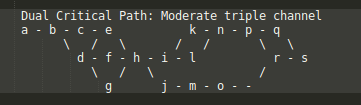

# CriticalPath
Calculate critical path

Based on [PMI.org article](https://www.pmi.org/learning/library/critical-path-method-calculations-scheduling-8040)

Kramer, S. W. & Jenkins, J. L. (2006). Understanding the basics of CPM calculations: what is scheduling software really telling you? Paper presented at PMI® Global Congress 2006—North America, Seattle, WA. Newtown Square, PA: Project Management Institute.

# Features

## Handles multiple critical paths

### Example: Dual critical paths in three channels

#### Critical Paths:
  
1.  a - b - d - g - h - i - k - n - p - r - s
1.  a - b - d - g - h - j - m - o - r - s

| (index) | id   | duration |           preds            |           succs            | es  | ef  | ls  | lf  | tf  | ff  |
| ------- | ---  | -------- |           :---:            |           :---:            | --- | --- | --- | --- | --- | --- |
|    0    | 'a' |    5     |             []             |         [ [Task] ]         | 0  | 5  | 0  | 5  | 0  | 0  |
|    1    | 'b' |    3     |         [ [Task] ]         |     [ [Task], [Task] ]     | 5  | 8  | 5  | 8  | 0  | 0  |
|    2    | 'd' |    2     |         [ [Task] ]         | [ [Task], [Task], [Task] ] | 8  | 10 | 8  | 10 | 0  | 0  |
|    3    | 'g' |    7     |         [ [Task] ]         |         [ [Task] ]         | 10 | 17 | 10 | 17 | 0  | 0  |
|    4    | 'h' |    1     | [ [Task], [Task], [Task] ] |     [ [Task], [Task] ]     | 17 | 18 | 17 | 18 | 0  | 0  |
|    5    | 'i' |    5     |         [ [Task] ]         |     [ [Task], [Task] ]     | 18 | 23 | 18 | 23 | 0  | 0  |
|    6    | 'j' |    6     |         [ [Task] ]         |         [ [Task] ]         | 18 | 24 | 18 | 24 | 0  | 0  |
|    7    | 'k' |    8     |         [ [Task] ]         |         [ [Task] ]         | 23 | 31 | 23 | 31 | 0  | 0  |
|    8    | 'm' |    6     |         [ [Task] ]         |         [ [Task] ]         | 24 | 30 | 24 | 30 | 0  | 0  |
|    9    | 'n' |    5     |     [ [Task], [Task] ]     |         [ [Task] ]         | 31 | 36 | 31 | 36 | 0  | 0  |
|   10    | 'o' |    12    |         [ [Task] ]         |         [ [Task] ]         | 30 | 42 | 30 | 42 | 0  | 0  |
|   11    | 'p' |    6     |         [ [Task] ]         |     [ [Task], [Task] ]     | 36 | 42 | 36 | 42 | 0  | 0  |
|   12    | 'r' |    8     |     [ [Task], [Task] ]     |         [ [Task] ]         | 42 | 50 | 42 | 50 | 0  | 0  |
|   13    | 's' |    1     |     [ [Task], [Task] ]     |             []             | 50 | 51 | 50 | 51 | 0  | 0  |
